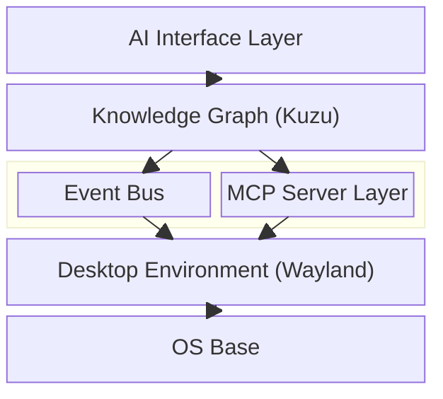
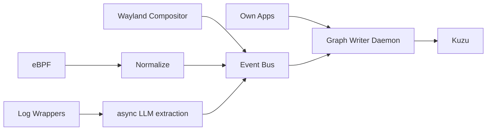
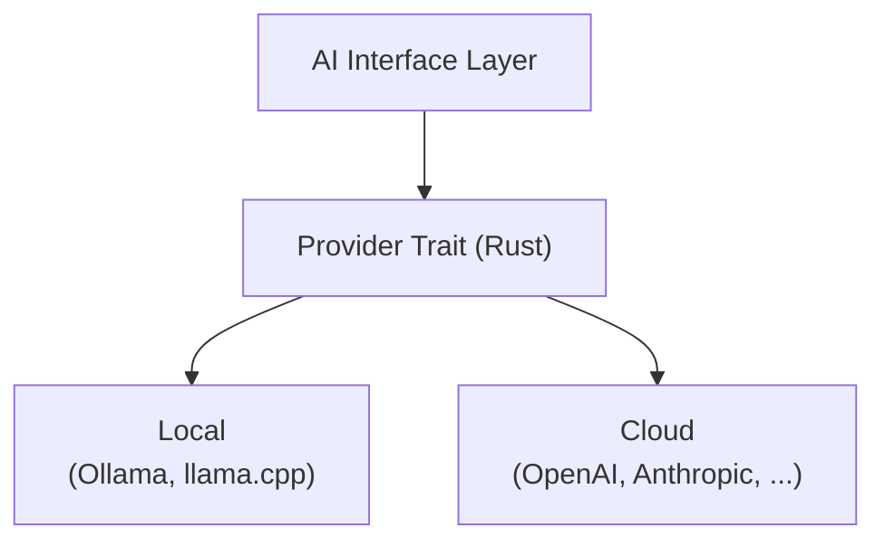

# [Project Name TBD] - Design & Architecture Documentation

> **Status:** Early planning phase. Everything here is subject to change.

---

## Abstract

This document describes the design, architecture, and philosophy behind [Project Name], a Linux-based operating system built from the ground up with a different set of priorities than most existing distributions.

The core idea: if you're building a desktop OS in 2025 anyway, there's no reason to repeat 30-year-old patterns. This project integrates a system-wide knowledge graph, AI interfaces, and modern tooling not as features bolted on top, but as foundational infrastructure. It also takes a clear stance on user sovereignty, European software independence, and not being annoying to use.

This is a long-term hobby project with ambitions of eventually becoming something more. It's built to be used by its own developer first.

---

## Table of Contents

1. [Vision & Philosophy](#1-vision--philosophy)
2. [System Architecture Overview](#2-system-architecture-overview)
3. [OS Base](#3-os-base)
4. [Event System](#4-event-system)
5. [Knowledge Graph](#5-knowledge-graph)
6. [AI Layer](#6-ai-layer)
7. [Desktop Environment](#7-desktop-environment)
8. [App Ecosystem](#8-app-ecosystem)
9. [Security & Privacy](#9-security--privacy)
10. [Developer Experience & Infrastructure](#10-developer-experience--infrastructure)
11. [Roadmap](#11-roadmap)
12. [Appendix: Technology Decisions](#12-appendix-technology-decisions)

---

## 1. Vision & Philosophy

### Why does this exist?

Most Linux distributions are either conservative remixes of existing systems or highly opinionated tools for a specific niche. That's fine. This is neither.

The goal here is to build a desktop OS that takes modern technology seriously - not as a checklist, but as a foundation. AI integration, a connected system-wide knowledge layer, a coherent design language, and respect for the user aren't features. They're the point.

### Core principles

**Future-oriented, not hype-driven.**
New technology gets used when it makes sense, not because it's trending. If we're building from scratch, there's no excuse for dragging along outdated patterns just because everyone else does.

**European & independent.**
No mandatory cloud accounts. No dependency on services that can be switched off by a company in another jurisdiction. The system works offline, self-hosted, and without phoning home. This is a technical stance, not just a marketing label - European digital sovereignty starts with the software people actually run.

**The knowledge graph belongs to you.**
All system intelligence runs locally by default. The knowledge graph, logs, AI context - none of it leaves the machine without explicit user action. Cloud AI providers are opt-in, not default.

**Good-looking is not optional.**
A bad UI is a barrier to entry. If the goal is to bring new users to Linux - whether individuals or companies - the system needs to look better than what they're coming from, on first boot. This is non-negotiable.

**Coherent, not cobbled together.**
Shared config standards, shared theming, shared interfaces across all system components. Change the accent color once and it propagates everywhere. No app that looks like it was designed in a different decade by a different team.

**Pragmatic, not ideological.**
No purity tests. The goal is a useful, trustworthy system - not proving a point about software freedom. That said: no ads, no tracking, no dark patterns. Not because of ideology, but because that stuff is just bad product design.

### What this is not

- A minimal/suckless system (there's complexity here and that's fine)
- A NixOS/Guix-style fully declarative system (though reproducibility is a goal)
- A distro for advanced Linux users only (new users are explicitly a target)
- A corporate product (at least not yet)

---

## 2. System Architecture Overview

> TODO: Add architecture diagram

### Layers (bottom to top)



### Key design decisions

- Event Bus and Knowledge Graph are the critical path - everything else builds on top of them
- AI layer is query-based first; autonomous/proactive features are explicit opt-in
- Desktop layer is architecturally independent and can be developed in parallel
- All AI providers (local or cloud) are interchangeable behind a common interface

---

## 3. OS Base

> TODO: Finalize base distribution choice

### Open questions

- Base distro: OpenSUSE Slowroll vs. Arch vs. Debian vs. other
- Filesystem: btrfs (likely), anything custom?
- Init system: systemd (default assumption)
- Package manager: keep base distro's, or add a layer on top?

### Constraints

- Must support eBPF out of the box (modern kernel required)
- Stability matters more than bleeding edge (startup/company use case in mind)
- European origin or governance preferred where possible

---

## 4. Event System

### Overview

Three sources of events, different quality levels:

| Source | Cooperation needed | Semantic quality |
|---|---|---|
| eBPF (kernel) | None | Low (syscalls, file access, network) |
| Wayland Compositor | Built-in (our compositor) | Medium (focus, window events) |
| App Events (own apps + wrappers) | Yes | High (structured, schema-validated) |

### Event Bus

- Not D-Bus (performance, no structured schema)
- Unix socket based with protobuf schema, or `zbus` if D-Bus compatibility turns out to matter
- All events normalized before hitting the Knowledge Graph

### eBPF

- Framework: `aya` (Rust)
- Tracks: file access, process lifecycle, network connections
- Used as fallback layer for apps that don't expose structured events

### Open questions

- Exact event schema (to be designed)
- How to handle high event volume without hammering the graph

---

## 5. Knowledge Graph

### Technology

**Kuzu** - embedded graph DB, MIT license, Rust bindings, high performance. No separate server process.

See Appendix for alternatives considered.

### Core entities (draft)

- `File` - path, type, timestamps, relations to processes/sessions
- `Process` / `App` - what ran, when, what it touched
- `Session` / `WorkContext` - temporal grouping of activity
- `Event` - raw actions, linked to entities
- `Project` - inferred grouping (derived, not manually set)
- `UserAction` - high-level abstraction over raw events ("edited document" not "57 write() syscalls")

### How the graph gets populated



### Open questions

- Full schema definition
- Retention policy (how long is data kept?)
- Query interface for the AI layer

---

## 6. AI Layer

### Provider abstraction

All AI access goes through a single provider trait. The rest of the system doesn't know or care if it's talking to Ollama, llama.cpp, OpenAI, or Anthropic.



User configures which provider is active. Sensitive operations (file contents, personal data) should default to local provider.

### Interaction model

**Phase 1 (query-based):**
User or system asks, AI responds. No background action without explicit trigger.

Examples:
- "What was I working on last Tuesday?"
- "Which files are related to project X?"
- "Why is my system slow since yesterday?"

**Phase 2 (autonomous, opt-in):**
Background agent that observes events and acts proactively. Not default. Requires explicit activation per use case.

### MCP Integration

Model Context Protocol used to give AI access to individual app interfaces. Own apps implement MCP servers natively. Third-party apps get wrapper MCP servers, ideally shipped alongside packages.

### Open questions

- Which local models to officially support/recommend?
- How to handle context window limits when querying a large graph?
- Permission model: which apps/data can the AI access by default?

---

## 7. Desktop Environment

### Architecture

- **Compositor/WM core:** Rust (performance, safety)
- **UI layer (shell, taskbar, panels):** TypeScript + Tailwind CSS
- Communication between Rust core and UI layer: TBD (IPC, likely custom protocol or WebSocket-style)

### Wayland

Full Wayland compositor, no X11 fallback by default. XWayland support for legacy apps.

### Theming & Design language

- System-wide theme token system: one change propagates everywhere
- No per-app theming chaos
- Target: looks good out of the box, customizable without breaking coherence

### Core components

- Compositor + WM
- Taskbar / Launcher
- Settings app
- File Manager
- Terminal

### Open questions

- Exact IPC mechanism between Rust and TypeScript UI
- App framework for own apps (same stack as shell, or separate?)
- How to handle apps that don't follow system theming?

---

## 8. App Ecosystem

### Own apps

All core system apps built in-house. Follow shared design language, implement MCP servers, emit structured events.

### Third-party app strategy

- Wrappers for popular apps that add MCP interfaces and structured event emission
- Wrappers shipped alongside packages in the package manager where possible
- Log-based LLM extraction as fallback for apps with no wrapper

### Shared standards

- Common config format/location conventions
- Common theming interface
- Common notification system
- MCP server interface spec for apps that want to integrate

### Open questions

- Config format (TOML likely, but needs decision)
- How deep does wrapper support go for major apps (Firefox, VSCode, etc.)?

---

## 9. Security & Privacy

### Principles

- Knowledge graph is local by default, never synced without explicit user action
- No telemetry, no analytics, no phoning home
- AI cloud providers are opt-in with clear disclosure of what gets sent
- No mandatory accounts of any kind

### Access control for the knowledge graph

> TODO: Who can query the graph? Per-app permissions?

### eBPF security considerations

> TODO: eBPF programs run with elevated privileges - how is this sandboxed/audited?

### Open questions

- Permission model for graph access
- How to handle sensitive file content in graph nodes (do we store paths only, or content snippets?)
- Audit log for AI actions

---

## 10. Developer Experience & Infrastructure

### Repository structure

GitHub Organization (name TBD). Multi-repo:

```
org/
├── docs             ← this document and more
├── kernel-layer     ← eBPF, Event Bus
├── knowledge        ← Kuzu integration, graph schema
├── ai-layer         ← provider abstraction, MCP
├── compositor       ← Wayland WM core (Rust)
├── desktop-shell    ← Taskbar, Launcher (TypeScript/Tailwind)
├── apps-*           ← individual core apps
└── distro           ← build system, ISO generation
```

### Build system

Looking at `mkosi` for image generation. To be decided.

### CI/CD

- Per-repo: GitHub Actions, unit + integration tests
- Full system: QEMU-based VM tests

### Open questions

- Exact build system choice
- How to handle cross-repo dependencies and versioning?
- Release cadence

---

## 11. Roadmap

> TODO: Define phases with rough scope

### Phase 0 - Foundation (current)
- Architecture & design decisions documented
- Proof of concept: Event Bus + Knowledge Graph running as daemon, collecting basic system events

### Phase 1 - Core Infrastructure
> TBD

### Phase 2 - Desktop
> TBD

### Phase 3 - AI Integration
> TBD

### Phase N - Public Release
> TBD

---

## 12. Appendix: Technology Decisions

### Knowledge Graph: Why Kuzu

| Option | Why not |
|---|---|
| Neo4j | Community Edition has limits, not ideal for embedded use |
| Oxigraph | RDF-based, good for semantic web standards, overkill here |
| Apache Jena | Java |
| RDFox | Commercial |

Kuzu: MIT, embedded, Rust bindings, performant. Fits.

### Event Bus: Why not D-Bus

D-Bus has no structured schema enforcement and performance is not great for high-frequency system events. Custom Unix socket protocol with protobuf keeps it simple and fast.

### eBPF Framework: Why aya

Rust-native, no C required, actively maintained.

---

*Last updated: 2026-03*
*Author: Tim*
